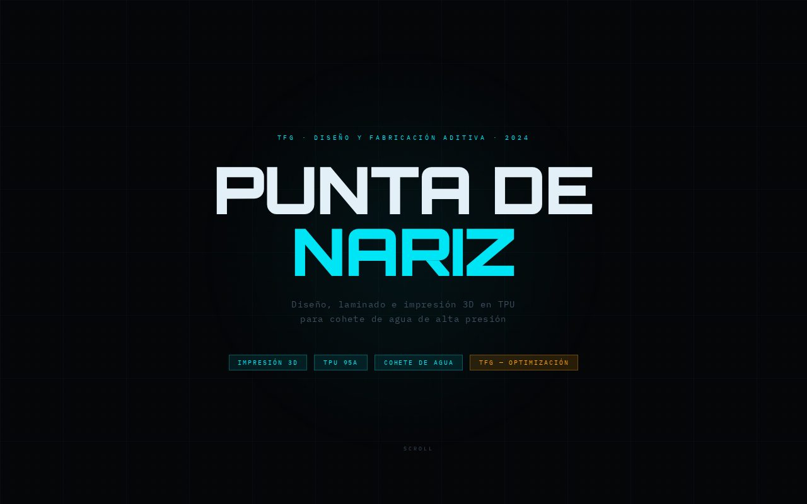

# APEX-1 · Punta de Nariz

Presentación web de un TFG de diseño e impresión 3D.

🔗 **[apex3d.puntozerosl.es](http://apex3d.puntozerosl.es/)**

## Qué incluye

- Contexto del proyecto
- Diseño CAD
- Laminado y preparación
- Proceso de impresión, resultado y conclusiones

## Tecnologías

 

---

Proyecto desarrollado por [PuntoZero](https://puntozerosl.es).
